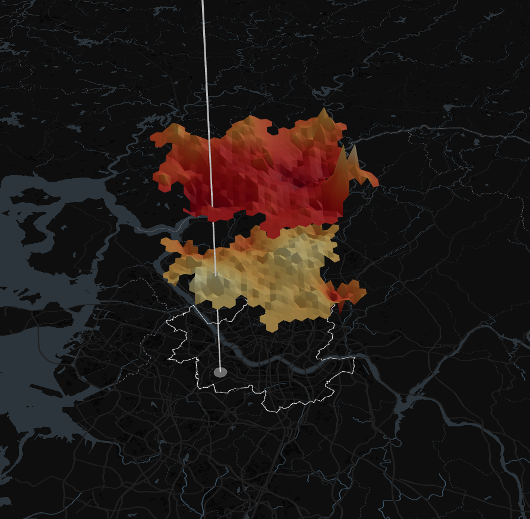

# Data Terrain
> **This project is currently under development.  
> You can check the latest updates and live demo at the link below:**  
>
> [https://seoul-data-terrain.netlify.app/](https://seoul-data-terrain.netlify.app/)

## Background

This project was initiated with the goal of helping the public explore and leverage the vast amounts of urban open data in the simplest way possible.  

Instead of wrestling with complex data formats and scattered APIs, we aim to lower barriers to data utilization for a diverse range of users—including citizens, researchers, and designers—by providing an intuitive interface and powerful visualization tools.

이 프로젝트는 도시의 방대한 오픈 데이터를 대중이 가장 간단한 방법으로 탐색하고 활용할 수 있도록 돕는 것을 목표로 시작되었습니다.  
복잡한 데이터 포맷과 흩어져 있는 API 대신, 누구나 쉽게 접근 가능한 인터페이스와 시각화 도구를 제공함으로써 시민, 연구자, 디자이너 등 다양한 사용자의 데이터 활용 장벽을 낮추고자 합니다.

## Visualization

The data visualization consists of three layers:

- The bottom layer integrates with a mapfrom Mapbox GL,
- The two upper layers are composed of 3D objects implemented with Three.js.

All three layers display data using a color heatmap, and the top two layers additionally allow data to be mapped to height.

데이터 시각화는 세 개의 레이어로 구성됩니다. 가장 하단 레이어는 Mapbox GL 지도를 기반으로 통합되며, 상위 두 레이어는 Three.js로 구현된 3D 객체로 구성됩니다.  
세 레이어 모두 색상 히트맵으로 데이터를 표현하며, 상위 두 레이어에서는 색상 외에도 높이(height)로 데이터를 매핑할 수 있습니다.

